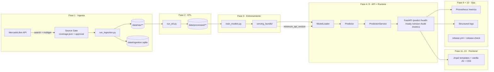
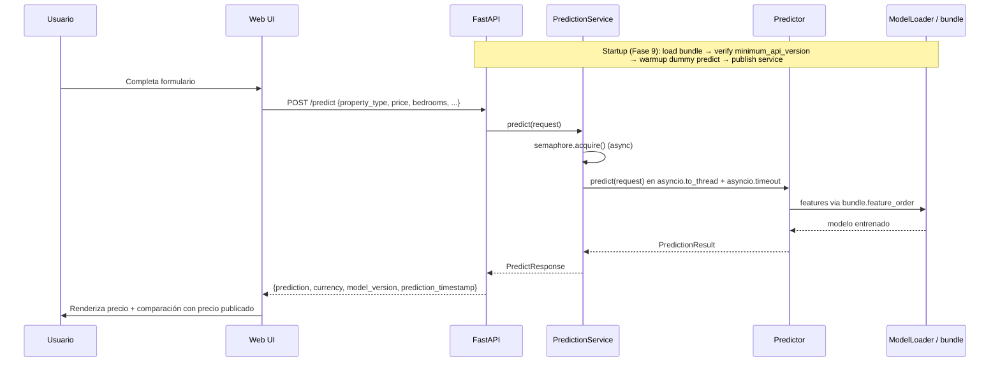
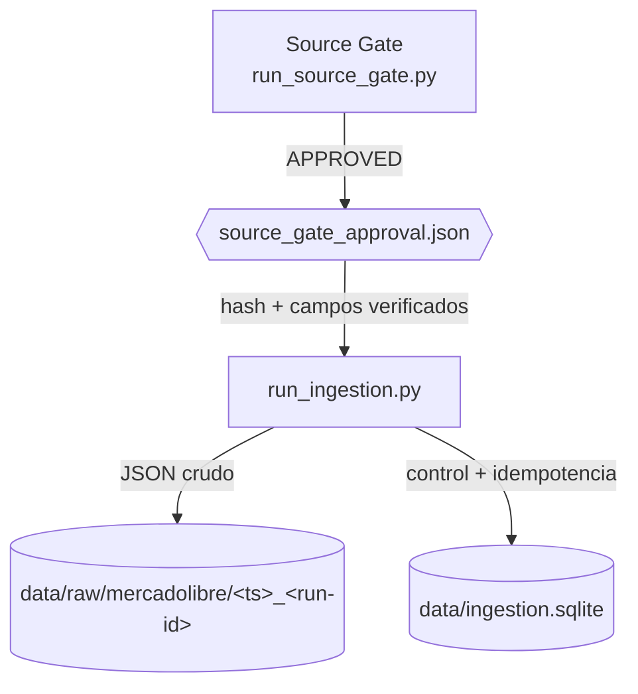
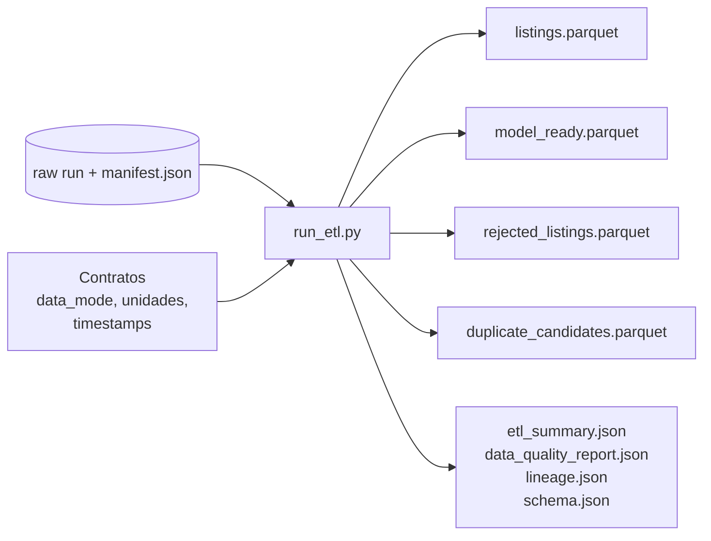
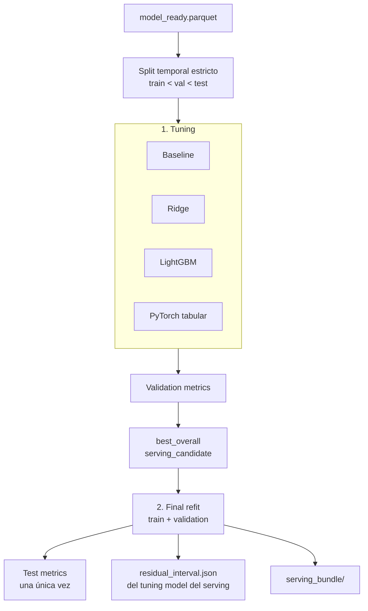
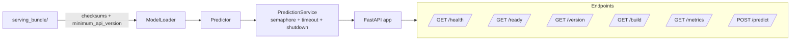
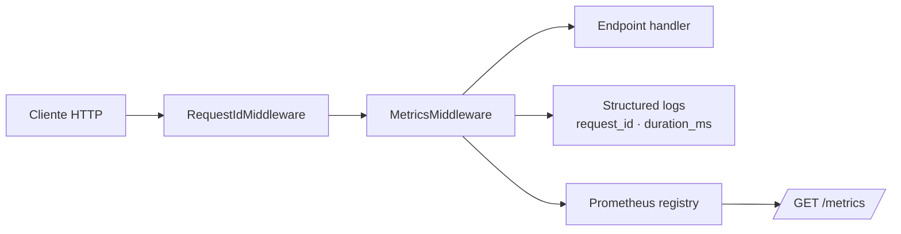

# Arquitectura

`alquileres-uy` es un pipeline end-to-end. Este documento describe
cómo fluyen los datos desde la ingesta hasta la interfaz web, y qué
componentes viven en cada capa.

## Índice

- [Visión general](#visión-general)
- [Flujo de datos](#flujo-de-datos)
- [Ingesta](#ingesta)
- [ETL](#etl)
- [Entrenamiento](#entrenamiento)
- [Serving](#serving)
- [Frontend](#frontend)
- [Observabilidad](#observabilidad)
- [Docker + Compose (opcional)](#docker--compose-opcional)

## Visión general



## Flujo de datos



## Ingesta



Puntos clave:

- El gate recorre jerárquicamente `/sites/{site_id}/categories`
  hasta encontrar las categorías finales (`apartment`, `house`) o
  aborta con `INCONCLUSIVE`.
- El approval **no** es el contrato final: es un puntero al
  `coverage.json`. El loader releé el coverage, valida su hash y
  compara campo por campo.
- La ingesta es idempotente por `item_id`: dos corridas no duplican
  filas.

## ETL



- **Publicación atómica**: el ETL escribe en `<workdir>.tmp` y sólo
  renombra al final.
- **Lineage**: `lineage.json` es el último archivo; incluye hashes
  SHA-256 de todos los inputs y outputs.
- **Modo fixture** vs. **modo real** — sólo el modo real requiere
  approval con hashes coincidentes.

## Entrenamiento



- Protocolo `tune-then-refit-v2`: el intervalo residual y las
  métricas de validation salen del tuning model; test se toca una
  única vez.
- PyTorch queda fuera del serving por decisión de arquitectura
  (evita cargar runtime de Torch en la imagen de API).

## Serving



- **Warmup** al startup: una predicción sintética a través del
  Predictor. Nunca toca Prometheus.
- **Timeout** vía `asyncio.timeout(PREDICT_TIMEOUT)` → HTTP 503
  con `prediction_timeout`.
- **Graceful shutdown**: `begin_shutdown()` rechaza nuevos,
  `wait_for_drain()` espera in-flight.

## Frontend

```mermaid
flowchart LR
  Templates[templates/base.html<br/>templates/index.html]
  Static[static/css/styles.css<br/>static/js/app.js<br/>static/favicon.svg]
  Web[/GET / (HTML)/]
  Fetch[fetch()]
  API[API JSON endpoints]
  LS[(localStorage:<br/>form + history)]

  Templates --> Web
  Static --> Web
  Web -->|POST /predict| Fetch
  Fetch --> API
  Web -->|save/restore| LS
```

- **Sin frameworks JS**: sólo `fetch`, `Intl.NumberFormat` y APIs
  del DOM.
- **Historial local**: hasta 10 predicciones, sin lat / lng / price
  (evitar fuga de PII a disco).
- **A11y**: `aria-live` en resultado, `aria-describedby` en cada
  input, `:focus-visible` outline, `prefers-reduced-motion` guard.

## Observabilidad



Métricas expuestas:

| Métrica | Tipo | Labels |
| --- | --- | --- |
| `prediction_requests_total` | Counter | endpoint, method, status_code |
| `prediction_errors_total` | Counter | endpoint, method, status_code |
| `prediction_latency_seconds` | Histogram | endpoint, method |
| `model_loaded` | Gauge | — |

Logs: una línea por request; nunca incluye payload, coordenadas ni
precio (política Fase 7+).

## Docker + Compose (opcional)

El proyecto se despliega como un único contenedor stateless. Un
`docker-compose.yml` no está incluido en el repositorio, pero el
patrón mínimo para desarrollo con Prometheus local es:

```yaml
version: "3.9"
services:
  api:
    build:
      context: .
      args:
        APP_VERSION: 0.10.0
    ports:
      - "8000:8000"
    environment:
      ALQUILERES_API_MODEL_BUNDLE_PATH: /app/artifacts/serving_bundle
    volumes:
      - ./artifacts/dev-run/serving_bundle:/app/artifacts/serving_bundle:ro

  prometheus:
    image: prom/prometheus:latest
    ports:
      - "9090:9090"
    volumes:
      - ./prometheus.yml:/etc/prometheus/prometheus.yml:ro
```

Sirve como referencia — no se prueba en CI.
